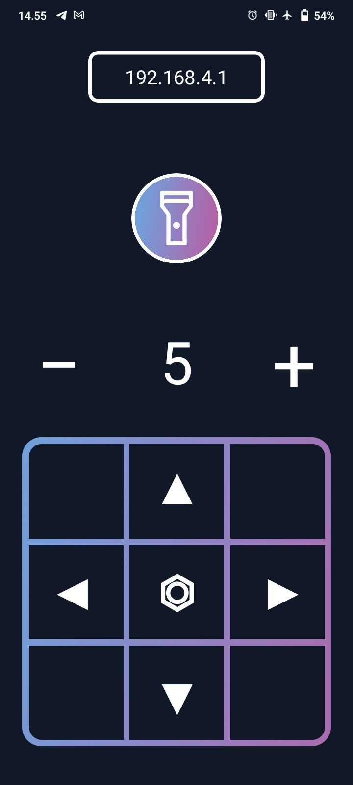

# ESP8266 Car Controller

This project is a React Native application designed to control a car powered by an ESP8266 microcontroller. The app allows users to connect to the car over Wi-Fi and send commands to control its movement.

## Features

- **Real-time control**: Control the car's movement (forward, backward, left, right).
- **Customizable controls**: Adjust button mappings and layouts to suit user preferences.
- **Wi-Fi connection**: Connect directly to the ESP8266 over a local Wi-Fi network.

## Installation

You can download the latest version of the app from the [Releases](https://github.com/MasFana/NativeRobotCar/releases/tag/stable1) page.

1. Go to the [Releases page](https://github.com/MasFana/NativeRobotCar/releases).
2. Find the latest release and download the APK file.
3. Install the APK on your Android device.

## Screenshots

| Screenshot                | Screenshot                 |
|---------------------------|----------------------------|
|  |  |

